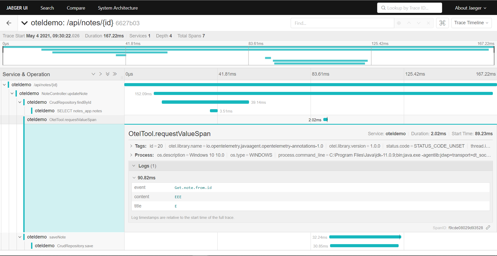
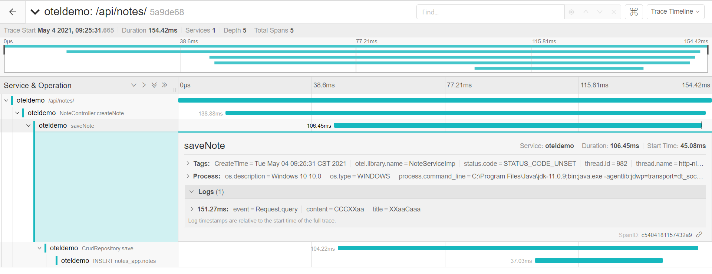
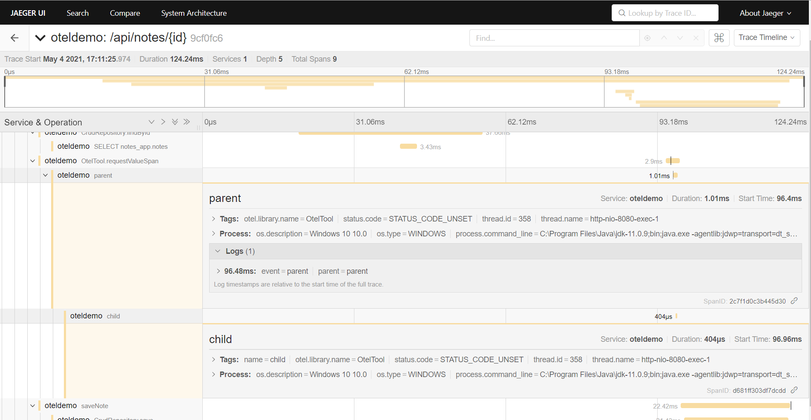

1. [@Controller vs @RestController](https://javarevisited.blogspot.com/2017/08/difference-between-restcontroller-and-controller-annotations-spring-mvc-rest.html#axzz6sRNhPjm3)
2. [Tracing API](https://github.com/open-telemetry/opentelemetry-specification/blob/0.3/specification/api-tracing.md#set-attributes)
3. [lightstep 教學](https://opentelemetry.lightstep.com/java/)
4. [opentelemetry JAVA 教學](https://opentelemetry.io/docs/java/manual_instrumentation/)

# Opentelemtry
## Opentelemtry 介紹
官方說 OpenTelemetry is a collection of tools, APIs, and SDKs. You can use it to instrument, generate, collect, and export telemetry data (metrics, logs, and traces) for analysis in order to understand your software's performance and behavior.

為了方便分析軟體性能與行為。

其支持的語言有
- JAVA
- C#
- Go
- javascript
- Python
- Rust
- C++
- Erlang/Elixir

支持的組件
- MySQL
- Redis
- Django
- Grpc
- Kafka
- Jetty
- Akka
- RabbitMQ
- Spring
- Flask
- net/http
- gorilla/mux
- WSG
- JDBC
- PostgreSQL

其第一個穩定版本於 2021/02 發布，預計下半年完成 Metric 部分。

## Opentelemtry 組件
- proto
    - 定義數據
- Specification
    - 有 API、SDK、Data
    - API: 用於生成數據。為每個數據源以及其他方面像是 baggage 和 propagators 定義。
    - SDK: 具有處理和導出功能的 API 實現。為每個數據源以及其他方面像是資源和配置定義。
    - 定義語義約定以提供與供應商無關的實現以及 OpenTelemetry 協議（OTLP）。
- Collector
    - 接收、處裡和導出數據
    - 支援發送到一個或多個開源或商業後端的開源可觀察性數據格式，例如 Jaeger、Prometheus 等
- Instrumentation Libraries
    - 蒐集不同組件的數據


### API
可將 API 分成以下
1. A Tracer API
2. A Metrics API
3. A Context API
4. A set of semantic conventions

##### Trace

Trace API 會產生 Span，而 Span 會是該 Trace 中所做的操作，表示 Trace 中連續的操作。在 Span 中會給予一個 traceId，當中可為帶有時間戳的事件進行其它訊息的添加。

##### Metric

[Metric API](https://github.com/open-telemetry/opentelemetry-specification/blob/main/specification/metrics/api.md) 提供各式各樣類型的度量存取，像是 Counters、Observers。可在 Span 上下文中觀察當前 CPU 負載和 Disk 資訊等。可參考官方的[資訊](https://github.com/open-telemetry/opentelemetry-specification/blob/main/specification/metrics/api.md#the-instruments)

##### Context

添加上下文的訊息，像是 [W3C Trace Context](https://www.w3.org/TR/trace-context/), Zipkin B3 headers等。此外，此 API 允許追蹤 Span 如何在系統中傳播。隨著trace 從一個行程傳播到下一個行程，上下文也會更新。度量工具不論何時都可以訪問當前上下文。

##### Semantic conventions

在 OpenTelemetry API 中包含一組[語義約定](https://github.com/open-telemetry/opentelemetry-specification/blob/main/specification/overview.md)，當中包含了命名 Span、屬性以及錯誤關聯至 Span 的準則和規則。藉由在API 規範中對此進行編程，OpenTelemetry 可確保所有工具（無論作者或語言）都包含相同的語義訊息。

### SDK

OpenTelemetry SDK 是 OpenTelemetry API 的實現。基本上由三個組件組成
- a Tracer
- a Meter
- and a shared Context layer that ties it all together


原則上 SDK 能夠滿足現有的需求，但這可以進行改動。

##### Tracer pipeline


### Collector


Receivers 會是數據的入口，它是 push 和 pull 模式，客戶端可以發送數據，或是以主動方式拉取數據。
Exporters 是出口，將數據丟至後端，同時也是 push 和 pull 模式
Processors 是一個管道的設置，是一個中間組間，可運行數據的處裡
Extensions 是其它的組件

## Opentelemtry 架構


左邊和右邊是不一樣的佈署方式。

## Resources 

在 OpenTelemetry 中，服務由**資源**描述，資源是在應用程式啟動期間初始化 OpenTelemetry SDK 時設置的。詳細規範可點擊此[鏈結](https://github.com/open-telemetry/opentelemetry-specification/tree/main/specification/resource/semantic_conventions#resource-semantic-conventions)。

|Attribute|Description|Example|Required|
|---|---|---|---|
|service.name|給予服務的額外名稱。對於水平擴展服務的所有實例，必須相同|oteldemo|Y|
|service.version|定義服務 API 或服務版本|aip:1.2.3|N|
|host.hostname|主機名或以域名表示|oteldemo.com.tw|N|

目前只能使用環境變數方式進行設置 `OTEL_RESOURCE_ATTRIBUTES`。這些的設定都是為了讓後端能夠進一步的識別分析。

## Span 
`Span` 是組成 `Tracer` 的單位。
### SpanContext
為了要有完整 `Tracer` 的過程，每個 `Span` 要將 `SpanContext` 傳遞至子 `Span。`

`SpanContext` 透過 `span_ID` 告知子 `span` 誰是父，以及它屬於什麼 `Tracer`（trace_ID）。
### Attributes
由 `Key-value` 組成，提供 `Span` 詳細的資訊。可以查詢、分組或以其他方式分析 `trace` 和 `span`。
##### Status
可將其設定為 `OK`、`Cancelled` 或 `Permission Denied`。
##### SpanKind
`SpanKind` 在 `Tracer` 中提供有用訊息，此 `Span` 是否為遠端系統? `SpanKind` 值可以為 `CLIENT`、`SERVER`、`PRODUCER`、`CONSUMER` 和 `INTERNAL`。詳細可參考官方[鏈結](https://github.com/open-telemetry/opentelemetry-specification/blob/main/specification/trace/api.md#spankind)
### Events
包含名稱、時間戳和可選的 `Attributes` 集合等。其表示在 `Span` 工作負載內的特定時間發生所發生的事件。可能如下

```
events: 
t:3
name:log
message: "retrieved 400 records"
...
```
## 程式碼實現概念
### Annotation @WithSpan
每次調用帶註釋的方法時，它會在當前 `Trace` 中創建一個子 `Span，並記錄所有引發的異常。

也可以透過 `exclude`，排除一些不要的場景。

### Accessing the tracer
如果要與 `Tracer` 進行交互，需要先獲取 `Tracer` 的實例。`Tracer` 以它們要檢測的組件命名。通常是一個 *library*、一個 *package*或一個 *class*。

```java
Tracer tracer = GlobalOpenTelemetry.getTracer(instrumentationName, instrumentationVersion);
```

### Span 屬性使用
- `Span` 中 `setAttribute` 是用於細分數據的索引。可能想要新增帳戶 ID 之類，以了解請求瓶頸和錯誤是否特定於某個帳戶或是否影響每個帳戶。
- `Span` 中 `addEvent` 可將細節做記錄，就是日誌的概念。這可自動查找與特定事務關聯的所有日誌，而不必進行大量的搜索和過濾。隨著服務的擴展這將是一個很好的追蹤過程

### Accessing the current span

`Span` 是在應用程式框架中被創建和管理。每個請求自動創建一個 `Tracer`，且應用程式程式碼已經被包裝在一個 `Span`，可用於新增特定於應用程式的*屬性*(setAttribute)和*事件*(addEvent)。

上述的前提是框架要被[支援](https://github.com/open-telemetry/opentelemetry-java-instrumentation/blob/main/docs/supported-libraries.md)。

```java
Span span = Span.current()
```

### Create own spans

當創建自己的 Span。這些範圍將自動成為當前範圍的子，同時新增至 `Tracer` 中。`Span` 管理包括三個步驟：開始 `Span`、設置為當前 `Span` 和結束 `Span`。當前如果存在 `Span`，`OpenTelemetry` 會將其創建為當前 `Span` 的子。會在 `Tracer` 上調用 `spanBuilder` 方法以觸發一個新的 `Tracer`。創建新的 `Span` 後，使用 `Scope` 建立一個新的代碼區塊，當中會包含子 `Span`。在該範圍內對 `Span.current()` 的任何調用都將回傳該子 `Span`，而不是請求的父 `Span`。都完成後，需呼叫 `end()` 方法來關閉 `Span`，否則會有洩漏問題。

### Error Handling

在 `OpenTelemetry` 中，異常記錄為事件。但是，為確保異常的格式正確，應使用 `span.recordException(error)` 方法而非 `addEvent`。

```java
childSpan.recordException(new RuntimeException("oops"));
childSpan.setStatus(StatusCode.ERROR);
```
在 `OpenTelemetry` 中，錯誤表示整體操作未完成。當異常被處理並不表示著整個操作都無法完成。為了示意操作失敗，需調用 `span.setStatus()` 並傳入錯誤代碼，該代碼可讓分析工具來自動觸發警報、測量錯誤率等。

## 實作

使用 `Annotation` 方式，此方式會建立一個 `Span`，而此 `Span` 會是觸發該 `Span` 的子 `Span`，我們這邊設置了屬性(setAttribute)和事件(event)這會以 `Log` 方式呈現。
```java
    @WithSpan
    public static void requestValueSpan(Note note) {
        Span span = Span.current();
        span.setAttribute("id", note.getId());
        span.addEvent("Get.note.from.id", Attributes.of(AttributeKey.stringKey("content"), note.getContent(),AttributeKey.stringKey("title"), note.getTitle()));
    }
```


下面算是實作 `@WithSpan` 的方式，只不過需要定義一個 `Tracer`，在建立一個 Span(spanBuilder)。

```java
private final Tracer tracer = GlobalOpenTelemetry.getTracer(NoteServiceImp.class.getSimpleName());
```
```java
    @Override
    public void saveNote(Note note) {
        // TODO Auto-generated method stub
        Span span = tracer.spanBuilder("saveNote").startSpan();
        try (Scope scope = span.makeCurrent()) {
            this.noteRepository.save(note);
            span.setAttribute("CreateTime", note.getCreatedAt().toString());
            span.addEvent("Request.query", Attributes.of(AttributeKey.stringKey("content"), note.getContent(),AttributeKey.stringKey("title"), note.getTitle()));
        } catch (Throwable t) {
            span.setStatus(StatusCode.ERROR, "Change it to your error message");
        } finally {
            span.end(); // closing the scope does not end the span, this has to be done manually
        }
    }
```



建立父子關係的 `Span`，在 child 方法中呼叫 `setParent`。

```java
    private static void parent() {
        Span parentSpan = tracer.spanBuilder("parent").startSpan();
        try {
            parentSpan.addEvent("parent", Attributes.of(AttributeKey.stringKey("parent"), "parent"));
            child(parentSpan);
        } finally {
            parentSpan.end();
        }
    }

    private static void child(Span span) {
        Span childSpan = tracer.spanBuilder("child").setParent(Context.current().with(span)).startSpan();
        try (Scope scope = childSpan.makeCurrent()) {
            childSpan.setAttribute("name", "child");
        } catch (Exception e) {
            // TODO: handle exception
        } finally {
            childSpan.end();
        }
    }
```



## 設定 optntelemtry agent
在 lunch.json 中設定 `vmArgs`
```java
{
    // Use IntelliSense to learn about possible attributes.
    // Hover to view descriptions of existing attributes.
    // For more information, visit: https://go.microsoft.com/fwlink/?linkid=830387
    "version": "0.2.0",
    "configurations": [
        {
            "type": "java",
            "name": "Launch Current File",
            "request": "launch",
            "mainClass": "${file}",
            "vmArgs": "-javaagent:opentelemetry-javaagent-all.jar -Dotel.resource.attributes=service.name=oteldemo -Dotel.exporter.otlp.endpoint=http://172.17.10.105:4317 -Dotel.exporter.otlp.traces.endpoint=http://172.17.10.105:4317 -Dotel.exporter.otlp.metrics.endpoint=http://172.17.10.105:4317"
        },
        {
            "type": "java",
            "name": "Launch OteldemoApplication",
            "request": "launch",
            "mainClass": "com.otel.example.oteldemo.OteldemoApplication",
            "projectName": "oteldemo"
        }
    ]
}
```
